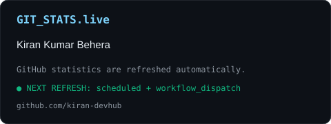
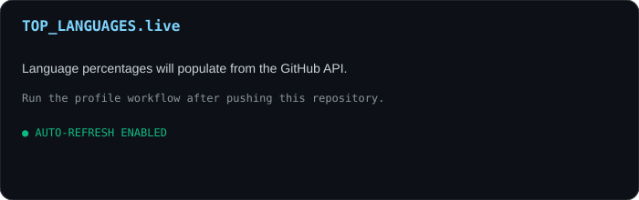

<div align="center">

<!-- BANNER - terminal profile.sh --live (additive). Generated by scripts/banner/generate.py.
     ~0.7–0.8 MB each. Cache-bust with ?v=N after regenerating. -->
<picture>
  <source media="(prefers-color-scheme: dark)"  srcset="assets/banner-dark.v9.svg">
  <source media="(prefers-color-scheme: light)" srcset="assets/banner-light.v9.svg">
  
</picture>

<br>

<a href="https://github.com/emmi-lili">
  
</a>

<br>

<a href="https://www.linkedin.com/in/emmi-aguilar-rivero/"></a>&nbsp;&nbsp;
<a href="https://instagram.com/emmcriptada"></a>&nbsp;&nbsp;
<a href="https://x.com/emmcriptada"></a>

<br>


</div>

<br>

`$ cat about_me.txt`

I'm a Blockchain Engineer and Tech Lead building the infrastructure that moves digital
assets — wallets, signing systems, custody rails — with a parallel obsession over making
that infrastructure something regular people can trust and actually use. I split my time
between institutional custody engineering at BitGo, growing the Stellar developer
community across LATAM, and teaching AI & Web3 in plain Spanish to people who never
thought tech was for them.

```ts
const emmi = {
  title: "Blockchain Engineer | Tech Lead | Digital Asset Infrastructure",
  role: "Technical Account Manager @ BitGo",
  based: "Bolivia 🇧🇴",
  stack: {
    languages: ["TypeScript", "JavaScript (ES6+)", "Rust", "Solidity", "Python"],
    frontend: ["React", "Next.js", "Tailwind CSS"],
    backend: ["Node.js", "REST APIs", "Wallet & Signing Infrastructure"],
    blockchain: [
      "Stellar / Soroban",
      "Smart Contracts",
      "Wallet Architecture",
      "Digital Asset Custody",
      "Move",
    ],
    databases: ["PostgreSQL"],
    devTools: ["Git", "GitHub", "Docker", "VS Code"],
  },
  leading: "Stellar Ambassador's Program — Bolivia Country Lead",
  brand: "@emmcriptada — AI & Web3 explained in plain Spanish",
  mission: "Help people who want to become great actually get there.",
  openTo: [
    "Web3 in LATAM conversations",
    "Mentorship & community building",
    "AI x blockchain collaborations",
    "Speaking opportunities",
  ],
} as const;
```

`$ ls -la tech_stack/`

```
drwxr-xr-x  Languages
drwxr-xr-x  Blockchain & Smart Contracts
drwxr-xr-x  Frontend
drwxr-xr-x  Backend & Infra
drwxr-xr-x  Databases
drwxr-xr-x  Dev Tools & OS
```

<div align="center">


</div>

`$ cat current_focus.yaml`

```yaml
building:
  - "Institutional custody & signing infrastructure @ BitGo"
  - "@emmcriptada — AI & Web3 explained in plain Spanish"

leading:
  - "Stellar Ambassador's Program — Bolivia country lead"
  - "Developer community programs & mentorship in LATAM"

exploring:
  - "Agentic workflows — AI agents that hold, move & verify value on-chain"
  - "Rust / Move for smart contract security patterns"

open_to:
  - "Web3 in LATAM conversations, always"
  - "Mentorship and collaboration with new developers"
  - "Speaking and community-building opportunities"
```

`$ git analytics --all`

<div align="center">

<table>
<tr>
<td width="50%" align="center" valign="middle">

<picture>
  <source media="(prefers-color-scheme: dark)"  srcset="assets/radar-dark.svg">
  <source media="(prefers-color-scheme: light)" srcset="assets/radar-light.svg">
  
</picture>

</td>
<td width="50%" align="center" valign="middle">

<picture>
  <source media="(prefers-color-scheme: dark)"  srcset="assets/radar-langs-dark.svg">
  <source media="(prefers-color-scheme: light)" srcset="assets/radar-langs-light.svg">
  
</picture>

</td>
</tr>
</table>

<picture>
  <source media="(prefers-color-scheme: dark)"  srcset="assets/card-stats-dark.svg">
  <source media="(prefers-color-scheme: light)" srcset="assets/card-stats-light.svg">
  
</picture>

<br>



</div>

`$ tail -f activity.log`

```
[status]   building custody & signing infra @ BitGo
[status]   leading Stellar Ambassador's Program — Bolivia
[status]   growing @emmcriptada — AI & Web3 in plain Spanish
[tz]       America/La_Paz
[note]     agents that hold, move & verify value on their own
```

`$ ./connect.sh --all`

<div align="center">

<a href="https://www.linkedin.com/in/emmi-aguilar-rivero/"></a>&nbsp;&nbsp;
<a href="https://instagram.com/emmcriptada"></a>&nbsp;&nbsp;
<a href="https://x.com/emmcriptada"></a>

<br><br>

<sub>` Build with love · @emmcriptada `</sub>

</div>
